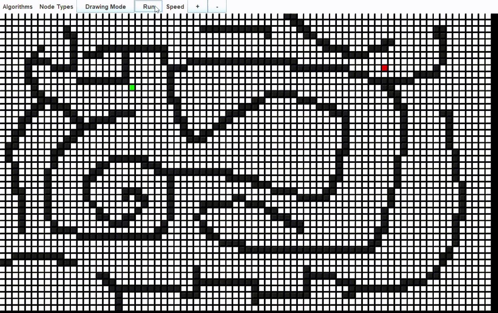

# Usage:
when in drawing mode, right-click/drag to place wall nodes, shift+right-click to remove nodes and 'c' to clear whole board.
When in solution showing mode 'c' to clear solution.

-DFS  
-BFS  
-Bi-Directional BFS  
-Dijsktra  
-A*  
To add a new algorithm you need to extend to MazeAlgorithm.java interface and implement the solve method, add algorithm choose menu option and add case in MazeFactory.java
